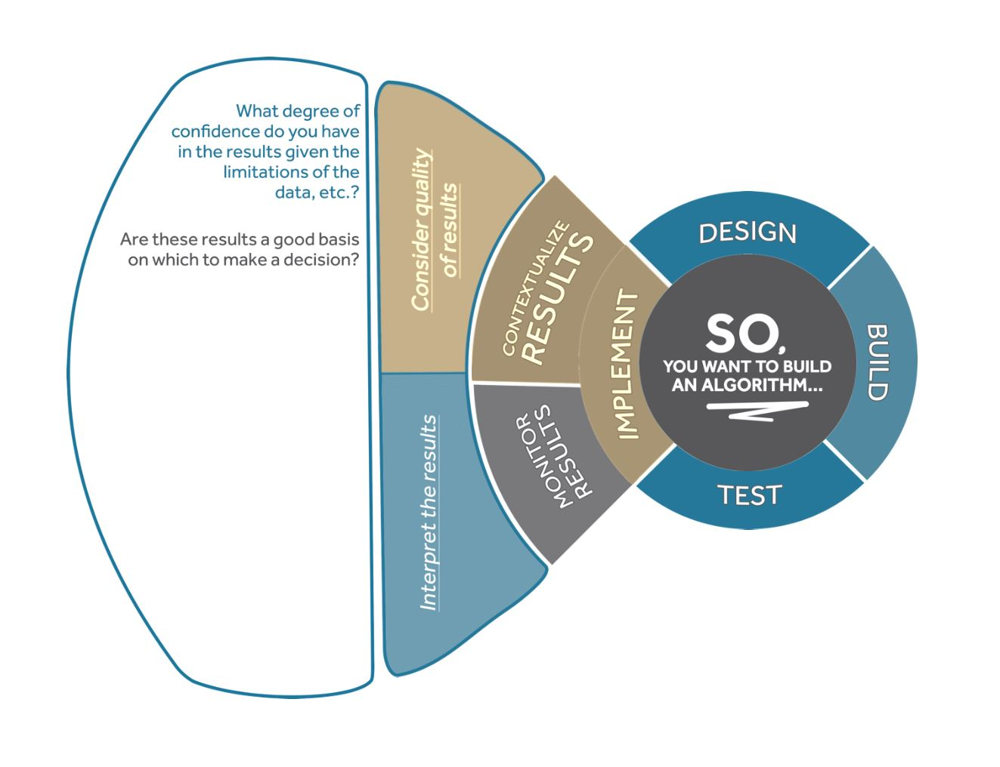
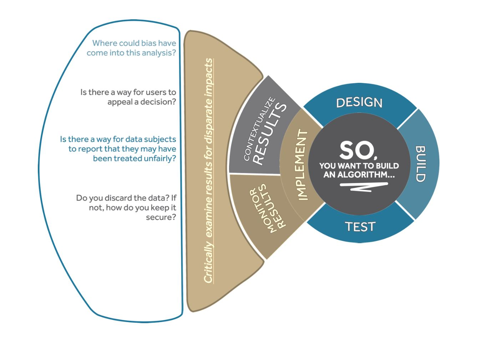
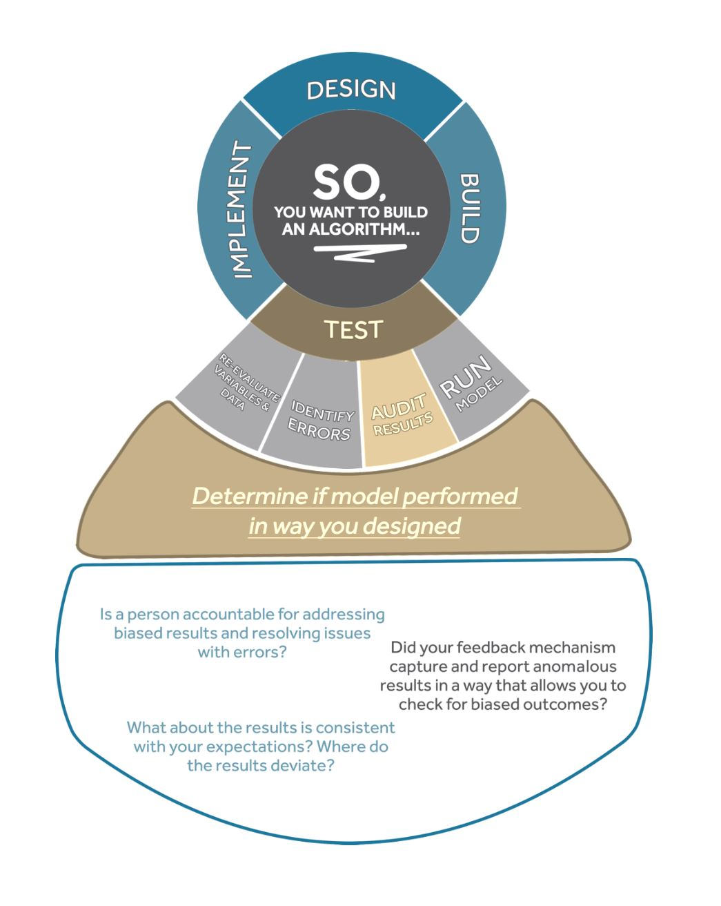

# [Center for Democracy & Technology](https://cdt.org/)

## So You Want to Build an Ethical Algorithm...

### Design

#### Concept
As your design the goal and the purpose of your machine learning product, you must first ask: **Who is your audience?**

* Is your product or analysis meant to include all people?
* And, if not: is it targeted to an exclusive audience?
* Is there a person on your team tasked specifically with identifying and resolving bias and discrimination issues?

#### Scope
After you have defined the concept of your machine learning problem, you need to **identify possible outcomes and define criteria that contribute to them**.

* How transparent will you be about the relationships between the inputs and the anticipated outcomes?
* Are there sensitive characteristics you need to monitor in your data in order to observe their effect on your outputs?

Then you will need to **define expected results**.

* Could your expectations rely on unacknowledged bias of you and your team?

_One way to check_: have you asked a **diverse** audience if your expectations make sense to them?

#### Data
Once the concept and scope have been defined, it is time to focus on the acquisition, evaluation, and cleaning of data.

##### Acquire Data (buy, collect, generate)

* Did the data come from a system prone to human error?
* Is the data current?
* What technology facilitated the collection of the data?
* Was participation of the data subjects voluntary?
* Does the context of the collection match the context of your use?
* Was your data collected by people or a system that was operating with quotas or a particular incentive structure? 

##### Evaluate & Describe Data

* Who is represented in the data?
* Who is under-represented or absent from your data?
* Can you find additional data, or use statistical methods, to make your data more inclusive?
* Was the data collected in an environment where data subjects had meaningful choices?
* How does the data reflect the perspective of the institution that collected it?
* Were fields within the data inferred or appended beyond what was clear to the data subject?
* Would this use of the data surprise the data subjects?

##### Clean Data

* Are there any fields that should be eliminated from your data?
* Can you use anonymization or pseudonymization techniques to avoid needless evaluation or processing of individual data?

#### Constrain

##### Establish logic for variables

* Can you describe the logic that connects the variables to the output of your equation?
* Do your variables have a causal relationship to the results they predict?
* How did you determine what weight to give each variable?

##### Identify assumptions

* Will your variables apply equally across race, gender, age, disability, ethnicity, socioeconomic status, education, etc.?
* What are you assuming about the kinds of people in your data set?
* Would you be comfortable explaining your assumptions to the public?
* What assumptions are you relying on to determine the relevant variables and their weights?

##### Define success

* What amount and type of error do you expect?
* How will you ensure your system is behaving the way you intend? How reliable is it?

### Build

#### Data Process

#### Tools
You have two options. The first: will you need to **choose tools from available libraries**?

* How could results that look successful still contain bias?
* Is there a trustworthy or audited source for the tools you need?
* Have the tools you are using been associated with biased products?

Or will you **build new tools from scratch**?

* Can you or a third-party test your tools for any features that can result in biased or unfair outcomes?

#### Feedback Mechanism

##### Internal

* Have you built in a mechanism to track anomalous results so that they can be analyzed?
* Is there a person on your team tasked with identifying the technical cause of biased outcomes?

##### External

* Is there a way for users to report problematic results including potentially discriminatory treatment?

### Test

#### Re-evaluate Variables and Data
You will need to **address errors by changing your variables and/or data**.

* Process any new data and variables with the same inquiry as the original model.
* What factors are predominant in determining outcomes?
* Are unintended factors or variables correlated with sensitive characteristics?

#### Identify Errors

##### Examine the distribution of errors

* Are errors evenly distributed across all demographics?
* Is the type of error the same for different populations? (i.e., false positives vs. false negatives)

##### Evaluate effect of error

* What is the impact on an individual of a false positive?
* What is the impact on an individual of a false negative?

#### Audit Results

//////////// CHECK ///////////////

#### Run Model
After you audit the results, you must **test the model on preliminary data set(s)**.

* Can you test your product using a data set that is representative (or over-samples) a diverse population based on race, socioeconomic status, gender, sexual orientation, ethnicity, age, disability, education, etc.?

### Implement

#### Contextualize Results

##### Consider quality of results

* What degree of confidence do you have in the results given the limitations of the data, etc.?
* Are these results a good basis on which to make a decision?

#### Monitor Results

##### Critically examine results for disparate impacts.

* Where could bias have come into this analysis?
* Is there a way for users to appeal a decision?
* Is there a way for data subjects to report that they may have been treated unfairly?
* Do you discard the data? If not, how do you keep it secure?

